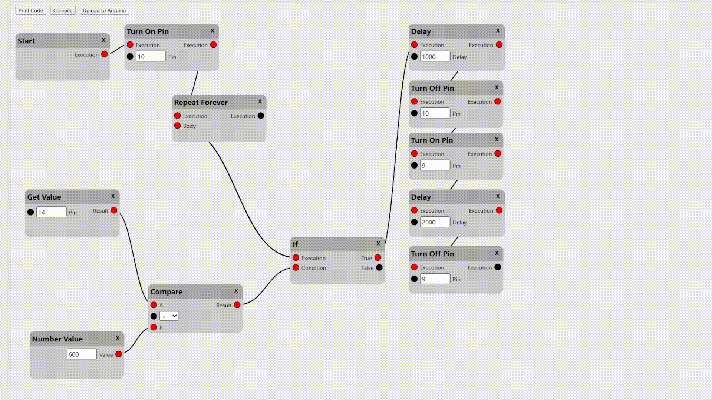

# Arduino Block IDE

A visual block-based programming environment for Arduino.



**Key Features:**
- 🧩 Drag-and-drop block programming
- 🔗 Connect blocks with wires to define program flow
- ⚡ Compile to real Arduino C code
- 📤 Upload directly to Arduino via Web Serial API
- 🔄 Pan and zoom canvas for large projects


## Architecture

```
┌─────────────────────────────────────────────────────────┐
│                    Frontend (Browser)                   │
│  ┌─────────────┐  ┌─────────────┐  ┌─────────────────┐  │
│  │   Blocks    │──│    Wires    │──│  Code Generator │  │
│  └─────────────┘  └─────────────┘  └────────┬────────┘  │
│                                              │          │
│                         ┌────────────────────▼────────┐ │
│                         │     Web Serial Uploader     │ │
│                         │       (STK500v1 Protocol)   │ │
│                         └────────────────────┬────────┘ │
└──────────────────────────────────────────────│──────────┘
                                               │
              ┌────────────────────────────────▼────────┐
              │          Arduino Board (USB)            │
              │         Uno / Nano / Mega               │
              └─────────────────────────────────────────┘

┌─────────────────────────────────────────────────────────┐
│                    Backend API Server                   │
│  ┌─────────────────────────────────────────────────────┐│
│  │   POST /api/compile                                 ││
│  │   Receives Arduino code → Returns compiled .hex    ││
│  │                                                     ││
│  │   Uses: arduino-cli (bundled in /bin)              ││
│  └─────────────────────────────────────────────────────┘│
└─────────────────────────────────────────────────────────┘
```

---

## Available Blocks

| Block | Description |
|-------|-------------|
| **Start** | Entry point of the program (only one allowed) |
| **Delay** | Pause execution for specified milliseconds |
| **Digital Write** | Set a pin HIGH or LOW |
| **Turn On Pin** | Shortcut to set pin HIGH |
| **Turn Off Pin** | Shortcut to set pin LOW |
| **Get Value** | Read digital or analog pin value |
| **If** | Conditional branching (true/false outputs) |
| **Compare** | Compare two values (==, !=, >, <, >=, <=) |
| **While** | Loop while condition is true |
| **Repeat Forever** | Infinite loop |
| **Print Line** | Serial.println() for debugging |
| **Number Value** | Numeric constant |
| **Text Value** | String constant |
| **Custom Code** | Write raw Arduino C code |

---

## Getting Started

### Prerequisites

- **Node.js** 18+ and pnpm
- **Chrome** or **Edge** (Web Serial API support)
- **Arduino board** (Uno, Nano, or Mega)

### 1. Start the Compilation Server

```bash
cd arduino-api
pnpm install
pnpm start
```

The server runs on `http://localhost:8001`.

### 2. Open the Frontend

Open arduinoapp/`index.html` in a browser.


### 3. Build Your Program

1. Right-click on the canvas to add blocks
2. Drag blocks to position them
3. Click and drag from pin circles to connect blocks with wires
4. Click the **X** on a block header to delete it

### 4. Compile & Upload

1. Click **Print Code** to see the generated Arduino code in console
2. Click **Compile** to compile the code (requires backend server)
3. Click **Upload to Arduino** to flash the compiled code to your board

---

## Supported Boards

| Board | Baud Rate | Page Size |
|-------|-----------|-----------|
| Arduino Uno | 115200 | 128 bytes |
| Arduino Nano | 57600 | 128 bytes |
| Arduino Mega | 115200 | 256 bytes |

---

## File Structure

```
arduinoapp/
├── index.html          # Main HTML file
├── main.css            # Styles for blocks, wires, and canvas
└── js/
    ├── block.js        # Block and Pin classes
    ├── blockLibrary.js # Block templates and factory
    ├── wires.js        # Wire drawing and connection logic
    ├── menu.js         # Right-click context menu
    ├── compileCode.js  # Code generation and compile API call
    ├── uploadToBoard.js # STK500v1 protocol implementation
    ├── myCanvas.js     # Pan and zoom functionality
    └── globalVars.js   # Shared state

arduino-api/
├── server.js           # Express server for compilation
├── package.json
└── bin/
    └── arduino-cli     # Arduino CLI binary
```

---

## API Reference

### `POST /api/compile`

Compile Arduino code to Intel HEX format.

**Request:**
```json
{
  "arduino_code": "void setup() { ... } void loop() { ... }"
}
```

**Response:**
```json
{
  "hex_data": ":100000000C9434000C943E000C943E000C943E00CA..."
}
```

---

## How It Works

### Block → Code Generation

Each block has an `arduinoCode()` method that recursively generates code by following output connections. The Start block aggregates all pin modes and generates the final `setup()` and `loop()` functions.

### Web Serial Upload

The uploader implements the STK500v1 protocol used by Arduino bootloaders:

1. Open serial port at board's baud rate
2. Reset the board via DTR/RTS signals
3. Sync with bootloader (triple sync)
4. Read and verify board signature
5. Enter programming mode
6. Upload firmware page by page
7. Exit programming mode

---

